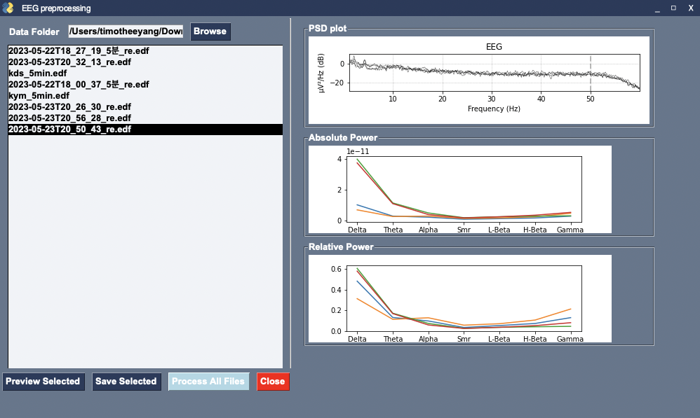

# EEG-data-processing

## Purpose
- Program to preprocess EEG(electroencephalogram) data (.edf format) which obtained from Biopac to get reletie power of each raw data.
- Reduce time effort for EEG data processing, mainly noise rejection and formatting
    - Previous workflow:
  > Obtain data from acqKnowledge -> convert .acq EEG data to .edf format -> import raw data to eeglab (do preprocessing) -> downsampling rate -> IIR filtering, Notch noise filtering -> capture ECG pattern (noise) -> reject ECG noise from EEG data -> auto rejection with ASR algorithm -> export temp data -> process with software to get absolute power and relative band power for each data channel
    - Simpliszed workflow:
  > Obtain data from acqKnowledge -> convert to .edf format -> run program -> get result

## Requirements:
Use acqKnoledge software to obtain data from Biopac EEG 100 device.

- data requirements
  > [.edf](https://www.edfplus.info/) format EEG data
  > data channle: not limited, same with [MNE package](https://mne.tools/stable/index.html)

- Environment
    - Python 3.7 +
    - Jupyterlab *View/Edit notebooks of .ipynb format*

- Packages
    - Basic pacages
        - numpy==1.21.6
        - mne==1.3.1
        - matplotlib==3.5.3
        - pandas==1.3.5
        - matplotlib==3.5.3

    - Algorithms
        - mne==1.3.1    *Open-source Python package for exploring, visualizing, and analyzing human neurophysiological data: MEG, EEG, sEEG, ECoG, NIRS, and more*
        - asrpy==0.0.2    *automatic noise rejection*

    - IO and data transform
        - eeglabio==0.0.2.post4    *export data to .set format, which can be imported to eeglab*
        - EDFlib-Python==1.0.8    *export data to edf format*
        - openpyxl==3.1.2    *convert results into excel*
        - XlsxWriter==3.1.8    *write dataframe into excel*

    - APP GUI and compiler
        - PySimpleGUI==4.60.5
        - psgcompiler==1.6.1

## Directories and files 
- Folders
    - Raw data: raw .edf data sample for test
    - notebook  *whole processing workflow and functions test for packages*
        - EEG_Pre_Tets.ipynb *test and debugging with MNE, ASR functions*
        - EEG_single data processing_re.ipynb  *whole processing flow to handle a single edf data*
        - EEG_multi data processing.ipynb  *modularized code to handle multi edf data*
    - main_program_no_GUI  * .py files for multiple edf data processing, same functionality with ipynb files*
    - GUI_Program  *Add interface to make a program based on the previous code

    - main_GUI_ALL.zip *download and unzip the compiled program, whole program running with Windows*

## Program guide

### Run compiled program directly
Download main_GUI_ALL.zip, unzip and click main_GUI_ALL.exe to execute program
Click browser to select target file folder, program will recognise edf files automatically
- Select a single file to preview result, save result to local disk.
- Process all edf data under current selected folder.

All processed results will appear under current selected folder with separate folder named after file name
- .png *Results of absolute and relative power of selected data*
- .edf *edf data file after preprocessing, can be use as further aims*
- .set *convert edf after preprocessing as a dataset of eeglab program, for further processing, you can import .set to **eeglab** directly and make use of that set file, for example, for further manual noise rejection
-  when process all data under folder, program will generate extra two xlxs files
   - absolute_power.xlsx *absolute results for all data processed, separated with tab
   - relative_power.xlsx *absolute results for all data processed, separated with tab

### Run whole project  :star:
- OPT 1. Run non GUI python program.
   Clone folder named **main_program_no_GUI**, create a new python project in your IDE, 
   change working directory to where your target data located, run **main.py**

- OPT 2. Run GUI program.
   Clone folder named **GUI_program**, import to your IDE, run **main.py**

- OPT 3. Run notebook.
   Download notebook in folder named **notebook**, open any ipynb support tools, for example Jupyterlab
   Import and run notebook to check

### Compile program on other OS
You can download source code under > GUI_Program > final_file > main_GUI_ALL.py
then compile with psgcompiler package :)

### Program interface and functionality

- Browse: Open file explorer to select folder contains target edf files
- Preview Selected : select a file and click to view results, show in right frame
- Save Selected: Save the results of current file after preview results generated by program
- Process All Files: Process all data under selected folder and generate results
